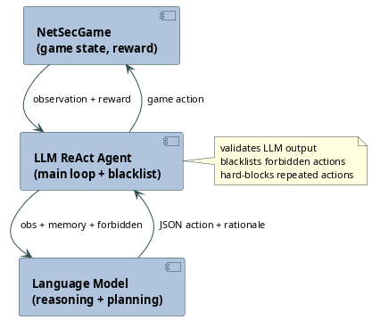
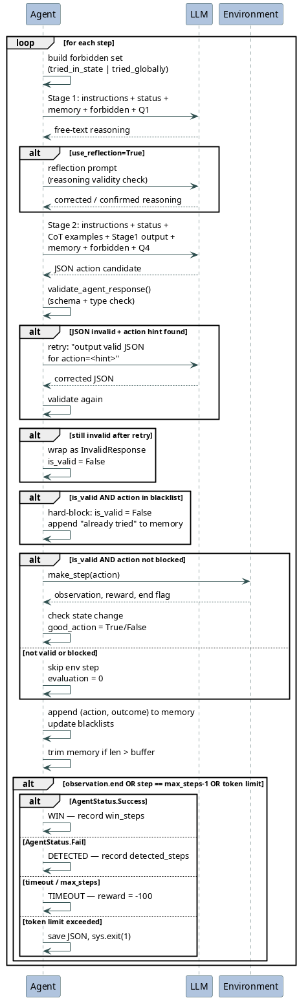

# LLM ReAct Agent — Architecture

## Overview

The LLM ReAct agent is an automated attacker for the NetSecGame environment. It uses a two-stage Reasoning + Acting (ReAct) loop to query a language model at each step, translate the model's output into a structured game action, and execute that action against the simulated network. The agent runs for a configurable number of episodes, tracking wins, detections, and timeouts across the run.

#### System Overview

The diagram below shows the three top-level actors and their primary interactions. The Agent sits at the center, relaying environment observations to the Language Model and translating its JSON responses into game actions. Information flows downward from ENV to AGENT (observations) and upward from AGENT to ENV (actions); a separate vertical loop connects AGENT and LLM for the reasoning cycle.

---

## Components

### Agent Loop (`llm_agent_react.py`)

The main loop initialises the game connection, iterates over episodes, and manages step-level control flow. For each step it calls `LLMActionPlanner.get_action_from_obs_react()`, inspects the result, optionally blocks forbidden actions, calls `agent.make_step()`, updates per-episode memory and blacklists, and checks for terminal conditions. It also handles Ctrl-C gracefully by saving partial results, enforces a cumulative token budget, and logs all metrics to MLflow.

### Action Planner (`llm_action_planner.py`)

`LLMActionPlanner` encapsulates all LLM interaction. It builds prompts from Jinja2-templated instructions and YAML-defined questions, issues two sequential LLM calls per step (Stage 1 for reasoning, Stage 2 for the final JSON action), applies optional reflection and self-consistency variants, extracts and fixes JSON from raw model output, and returns a 4-tuple `(is_valid, response_dict, action, retried)`.

### Response Validator (`validate_responses.py`)

`validate_agent_response()` checks that the LLM's JSON object contains a known action name and the correct required parameters with correct types. It normalises the `ExfiltrateData.data` field from various string formats into a `{owner, id}` dict. It also supports optional context-aware validation (checking that `target_service` appears in `known_services_map`). Returns a 2-tuple: `(validated_dict, None)` on success or `(None, error_message)` on failure.

### Prompt Configuration (`prompts.yaml`)

All prompt text is stored in YAML, keeping the Python code free of hard-coded strings. The file contains the Jinja2 `INSTRUCTIONS_TEMPLATE` (injects the per-episode goal), two Chain-of-Thought example blocks (`COT_PROMPT`, `COT_PROMPT2`), and four question templates (`Q1`–`Q4`). Stage 1 uses Q1 ("list objects and possible actions"), Stage 2 uses Q4 ("output the best next action as JSON").

---

## Agent ↔ LLM Interaction

Each step triggers two LLM calls through `openai_query()`, which wraps the OpenAI-compatible client with exponential-backoff retries (up to 5 attempts).

**Stage 1 — Reasoning.** The planner assembles: the goal instructions, the current status string (known networks/hosts/services/data), the memory prompt (up to `memory_buffer` past actions with their outcomes), the forbidden-actions block, and Q1. The LLM is asked to enumerate the current objects and what actions they enable. If `use_reflection` is active, a second call validates the reasoning and optionally corrects it. If `use_reasoning` is active (for `<think>` models), everything before `</think>` is stripped from the output.

**Stage 2 — Action selection.** The planner builds a new message list: goal instructions, current status, the CoT example block, the Stage 1 reasoning output, memory, the forbidden-actions block, and Q4. The LLM is asked to output a single valid JSON action. If `use_self_consistency` is active, Stage 1 is sampled `n=3` times and the plurality response is used, with temperature scaled by the repetition count in memory.

**Validation and retry.** The Stage 2 response is passed to `validate_agent_response()`. If that fails but an action name can be inferred from the raw text (`extract_action_hint()`), a targeted correction prompt is issued and the response is re-validated (`retried=True`). If validation still fails, the response is wrapped as `{"action": "InvalidResponse", ...}` so downstream code can treat it uniformly.

**Hard-block.** Even if validation passes, the main loop checks whether the resolved `Action` object is already in the per-state or global blacklist. If so, `is_valid` is set to `False`, the environment is not called, and a "already tried" entry is appended to memory.

#### Per-Step Sequence

The sequence diagram below traces one complete step of the ReAct loop between the Agent, LLM, and Environment. The `alt` blocks show the three divergence points: the optional reflection pass after Stage 1, the format-correction retry after Stage 2, and the four episode-end branches (WIN, DETECTED, TIMEOUT, TOKEN\_LIMIT).

---

## Agent ↔ Environment Interaction

At the start of each episode, `agent.request_game_reset()` returns an `Observation` containing the initial game state, the natural-language goal description, and the maximum step count. After each valid, non-blocked action, `agent.make_step(action)` sends the `Action` object to the game server and returns a new `Observation` with an updated state, a reward scalar, and an `end` flag. If the new state differs from the pre-step state, the action is classified as "helpful" (`good_action=True`); otherwise it is "not helpful". Invalid or blocked actions skip `make_step` entirely (evaluation score 0).

---

## Memory and Blacklisting

**Memory buffer.** A Python list of `(action_tuple, outcome_string)` pairs is maintained per episode. Outcome strings are `"helpful"`, `"not helpful"`, `"not valid based on your status."`, `"already tried in this exact state — choose a DIFFERENT action."`, or `"badly formatted."`. When the list exceeds `memory_buffer` entries the oldest entry is dropped (`memories.pop(0)`), creating a sliding-window context for the LLM.

**Per-state blacklist (`tried_in_state`).** A `dict[str, set[Action]]` keyed by a string serialisation of the current game state. An action is added here after every valid (non-blocked) execution. Forbidden actions are injected as a `[SYSTEM]` block in both Stage 1 and Stage 2 prompts.

**Global blacklist (`tried_globally`).** A `set[Action]` that accumulates `ExfiltrateData` and `ScanNetwork` actions across all states, because those actions are idempotent and should never be repeated regardless of state. Actions in this set are merged with the per-state set when building the forbidden prompt.

---

## Episode Lifecycle

1. **Init** — `BaseAgent.register()` connects to the game server once before the episode loop.
2. **Reset** — `request_game_reset()` initialises state, memory, blacklists, and counters for the new episode.
3. **Step loop** — up to `max_steps` iterations of the ReAct cycle described above.
4. **Termination** — the loop breaks when `observation.end` is `True` (success or detection) or when the step index reaches `max_steps − 1`. Terminal outcomes are:
   - **WIN** (`AgentStatus.Success`) — goal reached; step count recorded in `num_win_steps`.
   - **DETECTED** (`AgentStatus.Fail`) — agent was caught; step count recorded in `num_detected_steps`.
   - **TIMEOUT** (`AgentStatus.TimeoutReached` or max steps) — episode reward set to −100.
   - **TOKEN LIMIT** — cumulative token count across all episodes exceeds `max_tokens_limit`; episode data is saved and the process exits with code 1.
5. **Logging** — per-episode metrics are logged to MLflow; after all episodes, aggregate statistics are printed and `episode_data.json` is written.

---

## Key Design Decisions

**Two-stage prompting.** Separating "enumerate what is possible" (Stage 1) from "output the best JSON action" (Stage 2) reduces hallucination of invalid actions by forcing the model to first ground itself in the current state before committing to a specific action with exact parameters.

**Dual blacklisting.** Per-state blacklisting prevents loops within a single state, while global blacklisting for idempotent actions (ScanNetwork, ExfiltrateData) prevents wasteful retries across states. The forbidden set is injected both into the prompt and enforced by a hard-block in the main loop, so the constraint holds even if the model ignores the prompt instruction.

**JSON recovery pipeline.** `extract_json_from_response()`, `fix_incomplete_json()`, and the `extract_action_hint()` retry together form a three-layer recovery chain that tolerates common LLM formatting failures (markdown fences, prefixes, missing `action` keys) before escalating to an `InvalidResponse` sentinel.

**Optional prompting variants.** Reflection, self-consistency, and chain-of-thought reasoning (`use_reasoning` for `<think>` models) are all opt-in flags, keeping the default path simple while allowing experimental comparison of prompting strategies on the same codebase.
